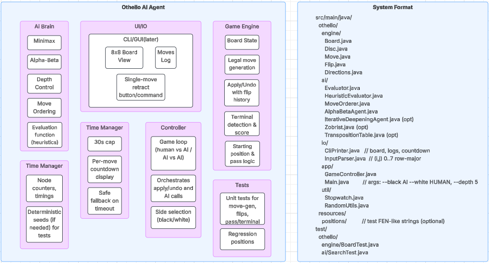

# Othello-Agent
An AI agent that behaves intelligently against an adversary in an Othello board game using optimization with Max-min, board evaluation at a depth (ply), and alpha-beta pruning algorithms
- agent can play either white or black
- uses he standard coordinate system, namely, the row-major where (i, j) means i-th row, j-th column. i and j= 0-7, starting at the bottom left corner
- prints information regarding before and after the move.
- Starting board configuration is: at the center, left upper is white
- "thinking" time for the AI is 30 sec max, countdown timer displayed
- has the capability to retract a single move, in case your opponent clicks a wrong button than what their code has asked for

Phase-1 report (2 page limit): 
- Algorithm/code summary
- computing platform
- language choice
- use of any external source (allowed with reference and modification)
- GUI (optional)
- Ply (depth of search)
- Board evaluation function
- Team management plan
- Any other issues.
  

